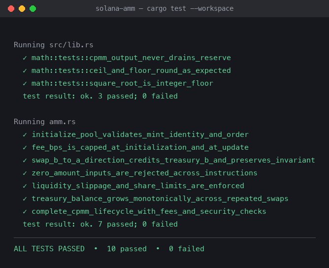

# Solana AMM

An Anchor program implementing a constant-product (x*y=k) automated market maker with protocol fees routed to a dedicated treasury. The math — checked multiply/divide, integer square root, and the swap-output formula — is hand-rolled, with no external AMM/DEX crate involved. The integration suite runs entirely in-process with LiteSVM.



## Assignment coverage

### 1. AMM program

- `initialize_pool`: creates a `Pool` PDA for an ordered `(mint_a, mint_b)` pair, two program-owned token vaults, and two treasury token accounts, and sets the initial `fee_bps`.
- `open_position`: creates a per-owner `Position` PDA that tracks LP shares independently of the pool's global `total_shares`.
- `add_liquidity`: deposits both sides of the pair. The first deposit mints `sqrt(amount_a * amount_b)` shares (subject to a `MINIMUM_LIQUIDITY` floor); every later deposit mints shares proportional to the existing reserves and enforces a caller-supplied `min_shares` floor.
- `swap`: executes the constant-product formula `amount_out = reserve_out * net_input / (reserve_in + net_input)` after deducting the protocol fee, and enforces the caller's `min_amount_out` slippage floor.
- `remove_liquidity`: burns shares for a pro-rata slice of both reserves, gated by `min_amount_a` / `min_amount_b` floors and an `InsufficientShares` check.

### 2. Fees and treasury account

- Every pool stores `fee_bps` (basis points, capped at `MAX_FEE_BPS` = 1,000 = 10%) plus `treasury_authority`, `treasury_a`, and `treasury_b`.
- On each swap, the fee is skimmed from the **input** token before the constant-product math runs, then transferred via `transfer_checked` into the treasury account for that input mint (`treasury_a` for `a_to_b` swaps, `treasury_b` for `b_to_a` swaps). The remaining net input is what actually moves the reserves and price.
- `update_fee` lets only the pool `authority` (`has_one = authority`) change `fee_bps`, still capped at `MAX_FEE_BPS`.
- Treasury accounts are owned by a separate `treasury_authority` (not the pool PDA), so fee collection is decoupled from swap/liquidity custody.

### 3. Tests covering all instructions

Rust/LiteSVM integration tests ([`tests/amm.rs`](programs/solana-amm/tests/amm.rs)) plus unit tests for the math module ([`src/math.rs`](programs/solana-amm/src/math.rs)) — 10 tests total, all passing:

| Test | What it proves |
| --- | --- |
| `complete_cpmm_lifecycle_with_fees_and_security_checks` | Full lifecycle across all six instructions: init → open position → add liquidity → swap (slippage-rejected, then accepted) → unauthorized fee update rejected, authorized update accepted → remove liquidity. Also asserts the constant-product invariant never decreases across a swap. |
| `initialize_pool_validates_mint_identity_and_order` | Identical mints and out-of-canonical-order mints are both rejected. |
| `fee_bps_is_capped_at_initialization_and_at_update` | `fee_bps` above `MAX_FEE_BPS` is rejected both at `initialize_pool` and at `update_fee`. |
| `zero_amount_inputs_are_rejected_across_instructions` | `add_liquidity`, `swap`, and `remove_liquidity` all reject a zero amount, and pool state is unchanged after each rejection. |
| `swap_b_to_a_direction_credits_treasury_b_and_preserves_invariant` | The reverse swap direction routes its fee into `treasury_b` (not `treasury_a`) and still preserves `x*y=k`. |
| `treasury_balance_grows_monotonically_across_repeated_swaps` | Three consecutive swaps strictly increase the treasury balance each time — fees accumulate and never leak or regress. |
| `liquidity_slippage_and_share_limits_are_enforced` | `add_liquidity` rejects deposits that can't mint `min_shares`; `remove_liquidity` rejects withdrawals below `min_amount_a`/`min_amount_b` and rejects burning more shares than a position holds. |
| `math::tests::square_root_is_integer_floor` | `integer_sqrt` is correct at boundary and large values. |
| `math::tests::cpmm_output_never_drains_reserve` | `swap_output` matches the expected x*y=k output and never returns more than the pool holds. |
| `math::tests::ceil_and_floor_round_as_expected` | `checked_mul_div_floor`/`_ceil` round in the directions each call site relies on (floor for payouts, ceil for required deposits). |

Every instruction (`initialize_pool`, `add_liquidity`, `open_position`, `swap`, `remove_liquidity`, `update_fee`) is exercised by at least one success path and at least one failure path.

### 4. CPMM without a library (extension)

`programs/solana-amm`'s only dependencies are `anchor-lang` and `anchor-spl` — no `raydium-*`, `orca-*`, or generic AMM/DEX crate is used anywhere in the dependency graph (verified against `Cargo.lock`). The constant-product math in [`src/math.rs`](programs/solana-amm/src/math.rs) — `checked_mul_div_floor`/`checked_mul_div_ceil`, `integer_sqrt`, and `swap_output` — is implemented from scratch on `u128` intermediates with explicit overflow checks, satisfying the "CPMM without using the library" extension.

### 5. Downtime mitigation (extension)

The on-chain program itself has no notion of "downtime" — once deployed, an Anchor program is always live; every validator that processes the slot can execute it. "Downtime" for a DeFi AMM app is therefore almost entirely a **client, RPC, and frontend** concern, plus a few pool-level design choices that limit blast radius when something upstream does go wrong:

- **Multi-RPC / fallback endpoints.** A production client should never hard-code a single RPC URL. Round-robin or health-checked fallback across several providers (plus a self-hosted RPC where feasible) means an outage at one provider doesn't take down the whole app. This is a pure frontend/client concern — `solana-amm` the program has no dependency on any particular RPC.
- **Client-side retry/backoff, not blind resubmission.** LiteSVM's `expire_blockhash()` behavior in this repo's test harness is a small illustration of a bigger real-world issue: a transaction built against a stale blockhash simply won't land. A real client needs bounded retry with fresh blockhashes, not a resubmission loop that could double-submit if the first attempt actually landed. Because `swap`, `add_liquidity`, and `remove_liquidity` all take explicit slippage/minimum parameters (`min_amount_out`, `min_shares`, `min_amount_a`/`min_amount_b`), a retried transaction is still safe from a stale-price standpoint — it either meets the caller's floor or reverts, it never executes at a worse price silently.
- **Stale-quote protection is the most important defense here.** If a frontend's price feed or indexer falls behind (its own "downtime"), the danger isn't that swaps stop working — it's that a user could sign a swap priced against stale reserves. Because every swap enforces `min_amount_out` on-chain (computed from the *current* `reserve_a`/`reserve_b`, not whatever the client last fetched), a degraded/stale frontend can at worst cause a failed transaction, never a silently bad fill. The same reasoning applies to `add_liquidity`'s `min_shares` and `remove_liquidity`'s `min_amount_a`/`min_amount_b`.
- **Pool-level circuit breakers / pause authority.** This program does not currently implement a pause flag, and that's a deliberate scope decision for a course assignment — but it's the natural next step for production: an `authority`-gated `paused: bool` on `Pool`, checked at the top of `swap`/`add_liquidity`/`remove_liquidity`, would let the same `has_one = authority` pattern already used by `update_fee` gate emergency halts (e.g., during an oracle/indexer incident or a suspected exploit) without needing a program upgrade.
- **Off-chain indexer redundancy.** Anything that reads `Pool`/`Position` state for display (reserves, APR, a user's share balance) should not depend on a single indexer. Running redundant indexers (or falling back to direct `getAccountInfo` + `Pool::try_deserialize` against multiple RPCs, the same decode path this repo's tests use) keeps the UI honest even if one indexing pipeline lags or dies — again, worst case is a stale *display*, not a stale *execution*, because execution correctness is enforced on-chain by the slippage floors above.
- **Treasury and fee design as a downtime-adjacent concern.** Because `treasury_a`/`treasury_b` are separate accounts owned by `treasury_authority` (not the pool PDA), fee sweeps or treasury-authority rotation can happen independently of pool liquidity operations — an incident affecting the treasury side (e.g., a compromised or unavailable treasury authority) doesn't block swaps, deposits, or withdrawals, since none of those instructions require the treasury authority to sign.

In short: the program is always live; the real availability work is client-side (multi-RPC, safe retries) and defense-in-depth against *stale information* rather than *program downtime*, since the on-chain slippage/minimum parameters already make stale quotes fail safely instead of executing badly.

## Architecture

```text
programs/solana-amm/
├── src/
│   ├── lib.rs                    # Anchor entrypoints
│   ├── constants.rs               # PDA seeds, fee cap, minimum liquidity
│   ├── error.rs                   # Shared custom errors
│   ├── math.rs                    # From-scratch checked math + CPMM swap formula (+ unit tests)
│   ├── state.rs                   # Pool and Position account layouts
│   └── instructions/
│       ├── initialize_pool.rs     # Pool, vault, and treasury account creation
│       ├── add_liquidity.rs       # open_position + add_liquidity handlers
│       ├── swap.rs                # Fee skim + constant-product swap
│       ├── remove_liquidity.rs    # Pro-rata withdrawal
│       └── update_fee.rs          # Authority-gated fee_bps update
└── tests/
    ├── common/mod.rs               # LiteSVM harness: mint/account helpers, instruction builders, seeded-pool fixture
    └── amm.rs                      # 7 integration tests covering every instruction plus negative/security cases
```

## Security properties

- Anchor `Signer`, typed account, `has_one`, `address`, and seed/bump constraints validate every caller-controlled account on every instruction.
- The mint pair is canonically ordered (`mint_a.key() < mint_b.key()`) and required to be distinct at `initialize_pool`, so the pool PDA and the `a_to_b` swap-direction branch are unambiguous.
- `swap` independently re-derives the expected source mint, destination mint, and treasury account for the requested direction and rejects any mismatch (`InvalidTokenAccount`) before moving funds.
- Pool and position assets move only through PDA-signed CPIs (`transfer_checked`) to the SPL Token program; `transfer_checked` binds every transfer to the expected mint and decimals.
- `assert_reserves` re-checks that on-chain vault balances match the pool's recorded `reserve_a`/`reserve_b` before every liquidity or swap operation, catching any drift between token-account state and pool bookkeeping.
- `fee_bps` is capped at `MAX_FEE_BPS` (10%) at both `initialize_pool` and `update_fee`, and only the pool `authority` can call `update_fee`.
- Every user-supplied amount is checked against zero, and every swap/deposit/withdrawal enforces the caller's slippage floor (`min_amount_out`, `min_shares`, `min_amount_a`/`min_amount_b`) before any transfer happens.
- All arithmetic goes through checked `u128` intermediates (`checked_mul_div_floor`/`_ceil`, `checked_add`/`checked_sub`) that return `MathOverflow` instead of panicking or wrapping.

## Build and test

Prerequisites: Rust 1.89, Solana CLI, and Anchor CLI compatible with Anchor 1.2.

```bash
NO_DNA=1 anchor build
cargo fmt --all -- --check
cargo clippy --workspace --all-targets -- -D warnings
cargo test --workspace -- --nocapture
```

The tests load `target/deploy/solana_amm.so`, so run `anchor build` before `cargo test` whenever the on-chain program changes.

## Program ID

Local program ID: `3SMKDteeV8JcQCxiq3vN3bJL2WvtHS1cGMXkdwqQDywD`

## License

[MIT](LICENSE)
